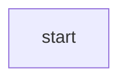

# Markdown Reference

[TOC]


## Overview

**Markdown** is created by Daring Fireball; the original guideline is here. Its syntax, however, varies between different parsers[^1] or editors. **Typora** is using GitHub Flavored Markdown.

## Block Elements

### Paragraph and line breaks

A paragraph is simply one or more consecutive [^2] lines of text. In markdown source code, paragraphs are separated by two or more blank lines. In Typora, you only need one blank line (press `Return` once) to create a new paragraph.

Press `Shift + Return` to create a single line break. Most other markdown parsers will ignore single line breaks, so in order to make other markdown parsers recognize your line break, you can leave two spaces at the end of the line, or insert `<br/>`.

### Headers

Headers use 1 - 6 hash(#) characters at the start of the line, corresponding to header levels 1-6. For example:

```markdown
# This is an H1
## This is an H2
###### This is an H6
```

In Typora, input ‘#’ s followed by title content, and press `Return` key will create a header.

### Blockquotes [^3]

Markdown used email-style `>` characters for block quoting. They are presented as:

```markdown
> This is a blockquote with two paragraphs. This is first paragraph.
>
>This is second pragraph. Vestibulum enim wisi, viverra nec, fringilla in , laoreet vitae, risus.


> This is another blockquote with one paragraph. There is three empty line to seperate two blockquote.
```

In Typora, inputting ‘>’ followed by your quote contents will generate a quote block. Typora will insert a proper ‘>’ or line break for you. Nested [^4] block quotes(a block quote inside another block) by adding additional level of ‘>’.

### Lists

Input `* list item 1` will create an unordered list — the `*` symbol can be replace with `+` or `-`.

Input `1. list item 1` will create an ordered list — their markdown source code is as follows:

````markdown
## un-ordered list
* Red
* Green
* Blue

## ordered list
1. Red
2. Green
3. Blue
````

### Task List

Task lists are lists with items marked as either `[]` or `[x]`(incomplete or complete). For example:

````markdown
- [ ] a task list item
- [ ] list syntax required
- [ ] normal **formatting**, @mentions, #1234 refs
- [ ] incomplete 
- [x] completed
````

You can change the complete/incomplete state by clicking on the checkbox [^5] before the item.

### (Fenced [^6]) Code Blocks
Typora only supports fences in GitHub Flavored Markdown. Original code blocks in markdown are not supported. 

Using fences is easy: Input `   `` `and press `Return`. Add an optional language identifier [^7] after ``` and we’ll run it through syntax highlighting:

```markdown
Here's an example:

​```
function test(){
	console.log("notice the blank line before this function?");
}
​```

syntax highlighting:
​```ruby
require 'redcarpet'
markdown = Redcarpet.new("Hello World!")
puts markdown. to_html
​```
```

### Tables 

Input `| First Header | Second Header |` and press the `Return` key. This will create a table with two columns.

After a table is created, putting focus on that table will open up a toolbar for the table where you can resize ,align. or delete the table. You can also use the context menu to copy and add/delete individual columns/rows.

The full syntax for tables is described below, but it is not necessary to know the full syntax in detail as the markdown source code for tables is generated automatically by Typora.

In markdown source code, they look like:

```markdown
| First Header | Second Header |
| ------------ | ------------- |
| Content Cell | Content Cell  |
| Content Cell | Content Cell  |
```

You can also include inline [^8] Markdown such as links , bold, italics [^9], or strikethrough [^10] in the table. 

Finally , by including colons( ``:`` ) within the header row, you can define text in that column to be left-aligned [^11], right-aligned, or center-aligned:

```markdown
| Left-Aligned | Center Aligned | Right Aligned |
| :------------| :------------: |--------------:|
| col 3 is     | some wordy text|    $1600      |
| col 2 is     | centered       |       &12     |
| zebra stripes| are neat       |        $1     |
```

A colon on the left-most[^12] side indicates a left - aligned column; a colon on the right - most side indicates a right - aligned column; a colon on both sides indicates a center - aligned column.

### Footnotes

```markdown
You can create footnote like this [^footnote]
[^footnote]: Here is the *text* of the **footnote**.
```

will produce:

You can create footnotes like this [^13]

Hover over[^14] the ‘footnotes’ superscript to see content of the footnote.

### Horizontal Rules [^15]

Inputting *** or - - - on a blank line and pressing `Return` will draw a horizontal line.

-----

### YAML Front Matter

Typora now supports YAMY Front Matter. Input ———- at the top of the article and then press `Return` to introduce a metadata block. Alternatively, you can insert a metadata block from the top menu of Typora.

### Table of Contents (Toc)

Input `[toc]` and press the `Return` key. This will create a “Table of Contents” section. The TOC extracts all headers from the document, and its contents are updated automatically as you add to the document.

## Span Elements

Span elements will be parsed and rendered [^16] right after typing. Moving the cursor [^17] in middle of those span elements will expand those elements into markdown source. Below is an explanation of the syntax for each span element.

### Links

Markdown supports two styles of links: inline and reference.

In both styles, the link text is delimited[^18] by [square brackets]. 

To create an inline link, use a set of regular parentheses [^19] immediately after the link text’s closing square bracket. Inside the parentheses, put the URL where you want the link to point, along with an optional title for the link, surrounded in quotes. For example:

```markdown
This is [an example](http://example.com/ "Title") inline link.
[This link](http://example.net/) has no title arribute.
```

will produce:

This is [an example](http://example.com/ "Title") inline link. 

[This link](http://example.net/) has no title attribute.

####Internal Links

**You can set the href to headers**, which will create a bookmark that allow you to jump to that section after clicking. For example:

```markdown
Click [This link](#block-elements) will jump to header Block Elements.
```

will be rendered like so:

`Ctrl` + Click [This link](#block-elements) will jump to header Block Elements. 

#### Reference Links

Reference-style links use a second set of square brackets, inside which you place a label of your choosing to identify the link:

```markdown
This is [an example][id] reference-style link.
Then, anywhere in the document, you define your link label on a line by itself like this:
[id]: http://example.com/ "Optional Title Here"
```

In Typora, they will be rendered like so:

This is [an example][id] reference-style link.

The implicit [^20] link name shortcut allows you to omit the name of the link, in which case the link text itself is used as the name. Just use an empty set of square brackets — for example, to link the word “Google” to the google.com web site, you could simply write:

```markdown
[Google][]
And then define the link:
[Google]: http://google.com
```

In Typora , clicking the link will expand it for editing, and `Ctrl` + click will open the hyperlink in your web browser.

#### URLs

Typora allows you to insert URLs as links, wrapped by <brackets>.

`<i@typora.io>` becomes <i@typora.io>

Typora will also automatically link standard URLs. e.g: www. google.com.

### Image

Images have similar syntax as links, but they require an additional `!` char before the start of the link. The syntax for inserting an image looks like this:

```markdown


```

You are able to use drag&drop to insert an image from an image file or your web browser . You can modify the markdown source code by clicking on the image. A relative path will be used if the image that is added using drag&drop is in same director or sub-directory as the document you’re currently editing.

### Emphasis

Markdown treats asterisks ( * ) and underscores( _ ) as indicators [^]


 


## Draw Diagrams With Markdown

Typora supports some Markdown extension for diagrams, you could enable this feature from preference panel.

When exporting as HTML, PDF, epub, docx





## Cheat Sheet

| Element                |         Syntax         |
| ---------------------- | :--------------------: |
| A Blank Line           |       Return key       |
| A Line Break           |        `<br/>`         |
| Header                 | 1 - 6 `#` + Return key |
| Blockquotes            |          `>`           |
| Unordered list         |    `*`or `+` or `-`    |
| Ordered list           |          `1.`          |
| Task Lists(incomplete) |        `- [  ]`        |
| Task Lists(complete)   |        `- [x]`         |
| Code Block             |        ```````         |
| Horizontal Rules       |         `---`          |
| Footnotes              |     `[^ footnote]`     |
| Table of contents      |  `[toc]` + Return key  |
| 


[^1]: 解析器
[^2]: 连续的；不间断的
[^3]: 块引用
[^4]: 嵌套的
[^5]: 复选框
[^6]: 受保护的
[^7]: 标识符
[^8]: 内联的
[^9]: 斜体；斜体字
[^10]: 删除线
[^11]: 左对齐
[^12]: 最左边的
[^13]: Here is the *text* of the **footnote**.
[^14]: 将鼠标悬停在
[^15]: 水平线；标尺线
[^16]: 渲染
[^17]: 指针；光标
[^18]: 限定
[^19]: 括号
[^20]: 内隐；隐式
[^21]: 指定

[id]: http://example.com	"“”Optional Title Here"